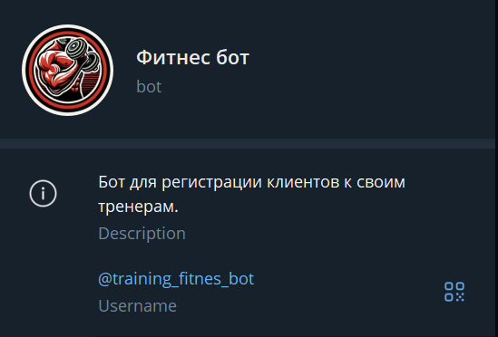
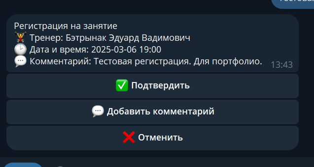
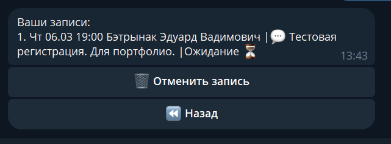
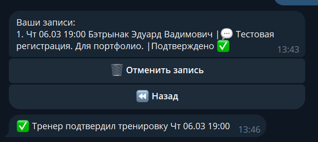

# Фитнес Бот
#### [Ссылка на бота](https://t.me/training_fitnes_bot) ⬅️

## Функционал бота 📋
- Регистрация клиентов
- Распределение клиентов по тренерам
- Функционал записи на тренировку 
- функционал проверки записей и их отмены, как со стороны тренера, так и клиента
- Гибкая настройка графика работы у тренеров
- Возможность назначения программы тренировок для клиентов

Бот помагает клиентам быстро записаться на тренировку.  
После регистрации тренировки тренеру необходимо ее подтвердить.  
Клиент может выбрать удобный и свободный для себя слот тренировок.

## 🛠 Стэк технологий
- python 3.12
- - aiogram
- - alembic
- - pydantic
- - sqlalchemy
- - alembic
- - apscheduler
- postgres
- docker
- - docker-compose
